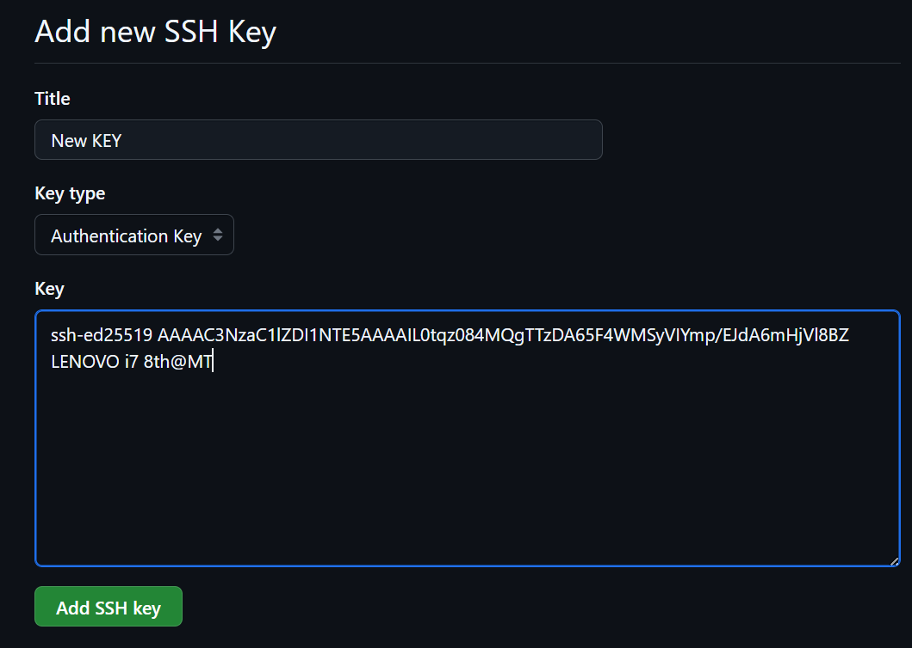

<p align = center > </p>

# 💻 Guía básica de Git & GitHub

> Repositorio de estudio para repasar  lo aprendido sobre **Git** y **GitHub**.

---

## 🧠 ¿Qué es Git y GitHub?

   --Es un sistema de control de versiones distribuido. <br>
   --Es una plataforma en la nube que hospeda repositorios Git y facilita colaborar.

- Git = herramienta en tu computadora.
- GitHub = lugar donde alojas/repositorios y colaboras.

---

## ⚙️ Configuración inicial

### 1️⃣ Configurar usuario y correo

```bash
git config --global user.name "Tu Nombre"
git config --global user.email "tu_correo@example.com"
```
Ver configuración:
```bash
git config --list
```
Definir rama principal como ***main*** (práctica moderna):
```bash
git config --global init.defaultBranch main
```
---
### 2️⃣ Crear una llave SSH

```bash
ssh-keygen -t ed25519
```
Ver contraseña generada:
```bash
cat ~/.ssh/id_ed25519.pub

#Copiar tu llave para el siguiente paso:
...
```
### 3️⃣ Crear una nueva llave SSH en GitHub.


Iniciar una conexión SSH hacia GitHub:
```bash
ssh -T git@github.com

# escribir: yes
```
`Hi user! You've successfully authenticated, but Github...`

### 4️⃣ Crear un nuevo repositorio
```bash
# Crear carpeta y entrar
mkdir mi-proyecto-git
cd mi-proyecto-git

# Inicializar repositorio
git init

# Borrar repositorio en caso de error:
rm -rf .git
```
Clonar un repositorio existente desde GitHub
```bash
git clone https://github.com/usuario/nombre-del-repo.git
```
Agregar repositorio remoto de GitHub
```bash
#agregar 
git remote add origin https://github.com/usuario/nombre-del-repo.git

#observar
git remote -v
```
Subir repositorio local a remoto (Hacer un PUSH)
```bash
#primera vez que se realiza un push a repo remoto:
git push -u origin main

#después:
git push
```
### 👀 Estado e historial
```bash
# Ver estado de archivos (modificados, sin seguimiento, etc.)
git status

# Ver historial de commits
git log

# Ver historial resumido en una línea por commit
git log --oneline
```
### ➕ Añadir y confirmar cambios (commits)
```bash
# Añadir un archivo específico
git add archivo.txt

# Añadir todos los cambios
git add .

# Crear commit
git commit -m "Mensaje del commit"
```
### 🌿 Trabajo con ramas
Las ramas permiten trabajar en nuevas características sin romper la rama principal. <br>
Crear una rama:
```bash
# Ver ramas existentes
git branch

# Crear nueva rama
git branch nombre-rama

# Cambiar a una rama (Git 2.23+)
git switch nombre-rama

# Forma clásica de cambiar de rama
git checkout nombre-rama

# Crear y cambiar en un solo comando
git switch -c nombre-rama
# o
```
### 🔗 Unir ramas (merge)
Supongamos que estás en ***main*** y quieres unir los cambios de ***rama-ejemplo***:
```bash
# Cambiar a main
git switch main

# Unir rama-ejemplo en main
git merge rama-ejemplo
``` 
  Otros comandos: <br>
  ` nano archivo.t `  <br>
  Edita archivos desde nano <br>
  `vi archivo.t`  <br>
  Edita archivos desde vi <br>
  `cat archivo.t`  <br>
  Muestra lo que contiene el archivo desde la terminal <br>
  
---
## 📚 Recursos recomendados
[Guía de Atlassian](https://www.atlassian.com/git)
